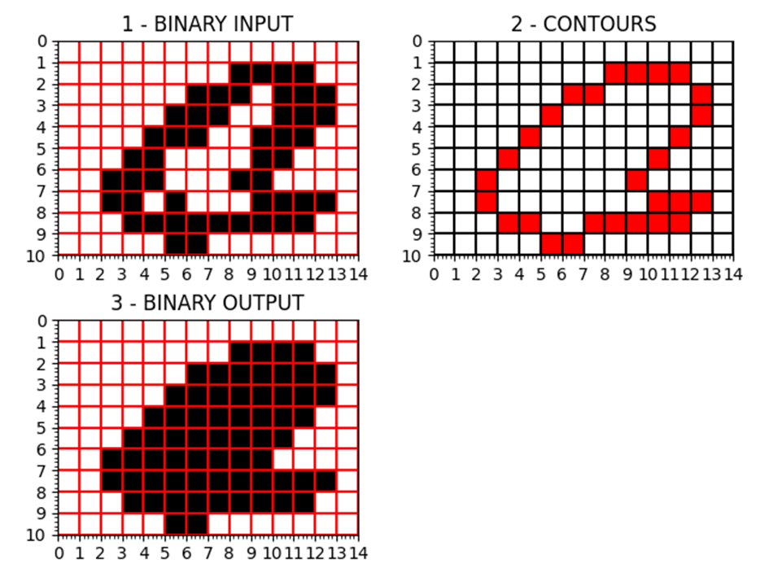

# SCRIPTING ASSIGNMENT

Write a Python script for a ‘fill’ functionality.

# 1. Input sample
Script reads ascii files like below: 

10 14  
0 0 0 0 0 0 0 0 0 0 0 0 0 0  
0 0 0 0 0 0 0 0 1 1 1 1 0 0  
0 0 0 0 0 0 1 1 1 0 1 1 1 0  
0 0 0 0 0 1 1 1 0 0 1 1 1 0  
0 0 0 0 1 1 1 0 0 1 1 1 0 0  
0 0 0 1 1 0 0 0 0 1 1 0 0 0  
0 0 1 1 1 0 0 0 1 1 0 0 0 0  
0 0 1 1 0 1 0 0 0 1 1 1 1 0  
0 0 0 1 1 1 1 1 1 1 1 1 0 0  
0 0 0 0 0 1 1 0 0 0 0 0 0 0  

# 2. Output sample
Script outputs a filled version of the image data:

10 14  
0 0 0 0 0 0 0 0 0 0 0 0 0 0  
0 0 0 0 0 0 0 0 1 1 1 1 0 0  
0 0 0 0 0 0 1 1 1 1 1 1 1 0  
0 0 0 0 0 1 1 1 1 1 1 1 1 0  
0 0 0 0 1 1 1 1 1 1 1 1 0 0  
0 0 0 1 1 1 1 1 1 1 1 0 0 0  
0 0 1 1 1 1 1 1 1 1 0 0 0 0  
0 0 1 1 1 1 1 1 1 1 1 1 1 0  
0 0 0 1 1 1 1 1 1 1 1 1 0 0  
0 0 0 0 0 1 1 0 0 0 0 0 0 0  
16

Where the last number is the amount of positions filled in.

# RESULTS
# 1. Original input:

# 2. Modified input 1:

# 3. Modified input 2:

